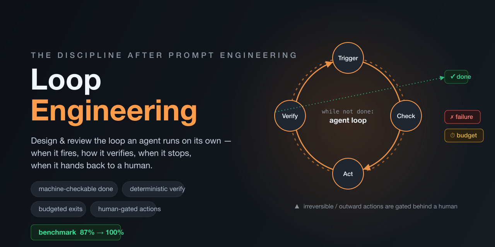

[English](README.md) · [繁體中文](README.zh-TW.md) · [简体中文](README.zh-CN.md) · [日本語](README.ja.md) · **한국어**

# Loop Engineering — 자율 agent loop 설계 & 리뷰를 위한 skill



Loop engineering은 prompt engineering 이후의 단계입니다. Prompt는 단일 상호작용을 최적화하지만, **loop**는 그것을 둘러싼 자율적인 동작을 최적화합니다 — agent가 *언제* 실행되는지, *무엇이* 트리거하는지, *어떻게* 스스로 작업을 검증하는지, *언제* 멈추는지, *언제* 인간에게 다시 넘기는지.

이 skill은 코딩 agent에게 두 가지 역할에 대한 실전 검증된 framework를 제공합니다:

- **Design mode** — 새로운 자동 실행 agent / loop / 백그라운드 워커를 구축합니다.
- **Review mode** — 기존 loop의 정지 조건, guardrail, verification, escalation 경로를 감사합니다.

Anthropic의 context engineering 가이드, Ralph loop / RPI 방법론, Claude Code의 agent-loop 문서, 2026년 "loop engineering" 글 등 12개 출처를 7가지 핵심 원칙과 참고 자료로 정리했습니다.

**빠른 시작 (Claude Code):**

```bash
git clone https://github.com/maxmilian/loop-engineering ~/.claude/skills/loop-engineering
```

새 세션을 시작하면 끝입니다. (다른 도구는 [설치](#설치) 참고.)

> 의도적으로 까다로운 케이스에서 no-skill 기준선과의 benchmark 테스트 결과, 이 skill은 통과율을 87% → 100%로 높이면서 더 일관성 있고 비용이 낮은 답변을 생성했습니다 — 강력한 모델도 놓치기 쉬운 미묘한 실패 모드(cron stale-prompt drift, 무분별한 retry 낭비, 되돌릴 수 없는 동작에 대한 human-gate 누락)에서 특히 효과가 두드러집니다. [재현하기 →](#benchmark-재현하기)
>
> **더 약한 모델(Haiku 급)**에서는 향상폭이 훨씬 커서, 8개 케이스 서브셋에서 **+16 포인트**(74% → 90%) — 커버리지 보장이 가장 중요한 영역입니다.

## 7가지 원칙 (TL;DR)

1. **레버리지는 prompt가 아닌 loop에서** — 거대한 mega-prompt 하나가 아니라 제어 흐름을 설계하세요.
2. **"완료"는 기계적으로 확인 가능해야 합니다** — `tests pass` ✓, `코드를 개선하라` ✗.
3. **검증은 결정론적 도구로, agent의 자체 보고에 의존하지 마세요.**
4. **실행 전에 모든 종료 조건을 정의하세요** — 성공 / 실패 / budget 종료, no-progress 감지, escalation 경로.
5. **Context를 유한한 자원으로 다루세요** — tool 출력을 줄이고, compaction, 노트 작성, sub-agent를 활용하세요.
6. **파일시스템을 메모리로 사용하고, 각 사이클은 fresh context로 시작하세요.**
7. **어려운 부분은 자율성이 아니라 verification, 정지, escalation입니다.** *반자율적(semi-autonomous)* 방식을 선호하세요: 되돌릴 수 없는/외부로 향하는 동작은 인간의 승인 뒤에 두세요.

## 구성

```
loop-engineering/
├── SKILL.md                          # the skill itself (frontmatter + instructions)
├── references/
│   ├── loop-patterns.md              # heartbeat / cron / hook / goal + Ralph loop
│   ├── context-engineering.md        # compaction, note-taking, sub-agents, JIT retrieval
│   ├── review-checklist.md           # per-principle diagnostic, severity-ordered
│   └── sources.md                    # the 12 source articles, with one-line summaries
├── evals/                            # 검증 케이스 라이브러리 + benchmark 근거
│   ├── evals.json                    # 채점된 design / review / diagnose 케이스 11개
│   ├── RESULTS.md                    # skill 있음 vs 없음 결과, 3개 iteration
│   └── files/                        # review 케이스가 가리키는 입력 스크립트
└── assets/                           # README hero 이미지
```

Skill은 `SKILL.md`(YAML frontmatter + Markdown)가 있는 폴더입니다. 이 이식성 덕분에 거의 어디서나 설치할 수 있습니다.

## 설치

### Claude Code
개인(모든 프로젝트) 또는 프로젝트 범위 — 폴더를 `skills/` 디렉터리에 복사하세요:

```bash
# personal
git clone https://github.com/maxmilian/loop-engineering ~/.claude/skills/loop-engineering
# or project-scoped
git clone https://github.com/maxmilian/loop-engineering .claude/skills/loop-engineering
```

새 세션을 시작하면 Claude가 `description`을 통해 자동으로 발견하고, agent loop를 설계하거나 리뷰할 때 자동으로 호출합니다. (사전 빌드된 `.skill` 번들: plugin/skill 관리자를 사용하는 경우 해당 관리자를 통해 설치하세요.)

### Codex
Codex는 자체 skills 디렉터리에서 skill을 기본 지원합니다. 폴더를 해당 위치에 넣으세요:

```bash
git clone https://github.com/maxmilian/loop-engineering ~/.codex/skills/loop-engineering
```

Codex 설정이 `AGENTS.md`를 기준으로 하는 경우, 다음과 같은 포인터 줄을 추가하세요:
`For designing or reviewing autonomous agent loops, follow skills/loop-engineering/SKILL.md.`

### GitHub Copilot CLI
Copilot은 설치된 플러그인에서 skill을 자동으로 발견합니다. 폴더를 Copilot skills/plugins 디렉터리(예: `~/.copilot/skills/loop-engineering`)에 넣고 CLI를 재시작하세요.

### Gemini CLI
Gemini는 skill 메커니즘을 통해 skill을 활성화합니다. 폴더를 Gemini skills 디렉터리(예: `~/.gemini/skills/loop-engineering`)에 넣으면, Gemini가 세션 시작 시 메타데이터를 로드하고 필요할 때 전체 내용을 활성화합니다. `GEMINI.md`로 Gemini를 구동하는 경우, `skills/loop-engineering/SKILL.md`에 대한 포인터 줄을 추가하세요.

### Cursor / Windsurf / instructions 파일이 있는 모든 agent
이 도구들에는 공식 skill 로더가 없지만, 내용은 그대로 활용할 수 있습니다. rules/instructions 파일(`.cursorrules`, `AGENTS.md` 등)에서 참조하세요:

```
When building or reviewing an autonomous/semi-autonomous agent loop, background
worker, or cron/webhook-driven agent, follow the framework in
skills/loop-engineering/SKILL.md (and its references/ files).
```

### 최소 공통 방식
모든 LLM 도구: loop를 설계하거나 리뷰할 때 `SKILL.md`를 context에 붙여넣고, skill이 참조할 때 `references/*.md` 파일을 함께 넣으세요.

## 사용 방법

명시적으로 호출할 필요 없습니다 — 작업을 설명하면 agent가 자동으로 인식합니다:

- *"CI를 밤새 감시하면서 실패한 PR을 스스로 수정하는 agent를 만들고 싶어."* → design mode
- *"이 백그라운드 워커를 더 많은 큐로 확장하기 전에 리뷰해 줘."* → review mode
- *"내 research agent가 token을 계속 소모하면서 완료를 못 하고 있어."* → 진단

## benchmark 재현하기

위 수치는 빈말이 아닙니다 — held-out 케이스가 이 repo에 들어 있어 직접 다시 돌려볼 수 있고, iteration별 전체 결과(skill이 *도움이 되지 않는* 지점에 대한 솔직한 메모 포함)는 [`evals/RESULTS.md`](evals/RESULTS.md)에 있습니다.

- **평가 세트**는 [`evals/evals.json`](evals/evals.json)에 있습니다: 네 가지 loop 패턴(heartbeat / cron / hook / goal)에 long-horizon context까지 아우르고 **design**·**review**·**diagnose** 모드에 걸친, 의도적으로 까다로운 11개 케이스 — CI/PR-fixer 설계, 결함 있는 지원 ticket bot(코드는 [`evals/files/`](evals/files/)), 폭주하는 research loop까지. 각 케이스에는 정답이 반드시 짚어야 할 구체 항목(machine-checkable한 done 조건, 실제 숫자가 들어간 모든 exit, 결정론적 검증, 되돌릴 수 없는 동작에 대한 human-gate 등)을 나열한 `expected_output` 루브릭이 함께 있습니다. 87% → 100%라는 헤드라인 수치는 그중 "미묘한 / 명세 부족" 하위 집합에서 나온 것이며, iteration별 분해는 [`evals/RESULTS.md`](evals/RESULTS.md)를 참고하세요.

**방법 (헤드라인 수치와 동일):**

1. 각 케이스에서 `prompt`를 **두 번** 실행 — 한 번은 skill을 설치한 상태(위의 제어 흐름), 한 번은 skill 없는 깨끗한 baseline — 분산을 평균화하기 위해 각각 여러 번.
2. 각 실행을 해당 `expected_output` 루브릭에 대조해 채점(나열된 assertion에 대해 LLM이 채점하며, 루브릭 항목은 객관적으로 확인 가능하게 작성됨).
3. 각 구성의 assertion별 통과율을 집계해 비교.

헤드라인 수치의 통과율 / 분산 / token 집계는 Anthropic의 `skill-creator` benchmark harness(`grader` + `aggregate_benchmark`)로 돌렸지만, 루브릭에 대조한 "skill 있음 / 없음" 비교라면 어떤 방식이든 같은 격차가 드러납니다. skill의 강점은 미묘한 실패 모드 — stale-prompt drift, 무분별한 retry 낭비, human-gate 누락 — 에 집중되며, 이는 강력한 모델도 기본값에 맡겨두면 건너뛰는 지점들입니다.

> **참고:** SKILL.md의 description과 skill body는 번역하지 않습니다. 모델이 읽는 skill 자체는 영어로 유지하며, README만 다국어로 제공합니다.

## 기여하기

기여를 환영합니다 — 새로운 worked example, 추가 loop pattern, 더 날카로운 review heuristic, 번역, 또는 수정. 편하게 issue나 PR을 열어주세요.

**AI 보조 기여도 명시적으로 환영합니다.** 이것은 agentic loop *에 관한* skill이므로, Claude Code / Codex / Copilot / Gemini(또는 임의의 coding agent)로 변경 사항을 작성하는 것을 권장합니다 — 주제에 잘 맞습니다. 제출 전에 agent의 출력을 review 하세요: 정확한지, 주장이 있는 부분은 실제 출처에 근거하는지(`references/sources.md` 참고), 그리고 자신 있게 제출할 수 있는지 확인하세요. 이 skill을 자신의 PR에 dogfood 하는 것도 환영합니다.


## 라이선스 / 출처

**MIT License** 로 배포됩니다 — [`LICENSE`](LICENSE) 참고.

Loop engineering, agent loop, context engineering에 관한 공개 글에서 정리했습니다 — 전체 출처 목록과 링크는 `references/sources.md`를 참고하세요.
